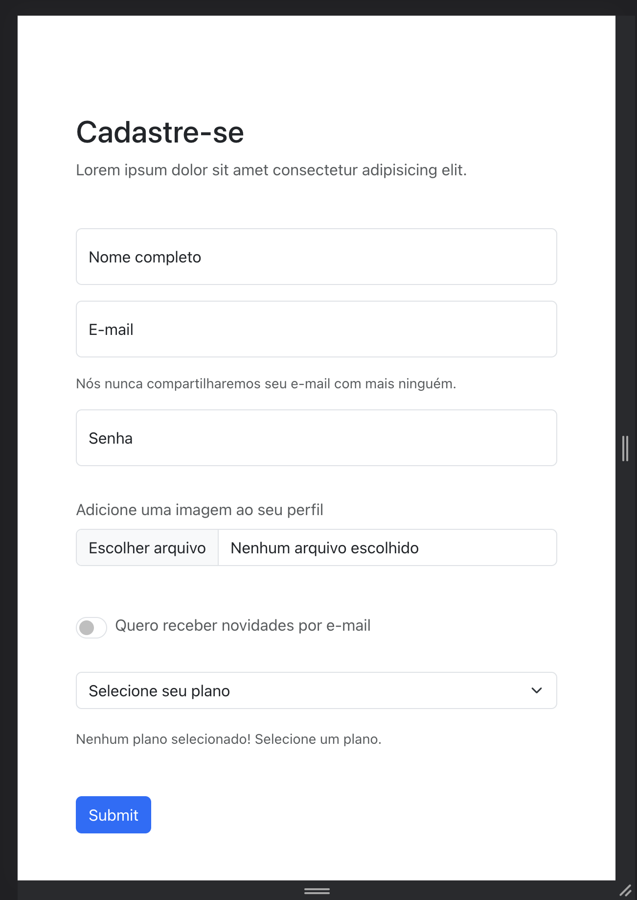

# 🍿 Gerenciador de Assinantes 🎬

Este é um projeto de um Gerenciador de Assinantes que oferece funcionalidades para cadastrar, editar, listar e excluir assinantes. O sistema permite o armazenamento de informações como código, nome, sobrenome, data de nascimento, telefone, endereço, cidade, estado e status (ativo ou inativo) de cada assinante.

## Requisitos

- Node.js (versão X.X.X)
- MongoDB (versão X.X.X)

## Instalação

1. Clone este repositório em sua máquina local.
2. Navegue até o diretório do projeto.
3. Execute o comando `npm install` para instalar as dependências.

## Funcionalidades

O Gerenciador de Assinantes oferece as seguintes funcionalidades através de uma API:

- Cadastro de assinante com campos como código, nome, sobrenome, data de nascimento, telefone, endereço, cidade, estado e status.
- Opção de upload de imagem de perfil para cada assinante.
- Edição das informações pessoais do assinante, incluindo status e foto de perfil.
- Listagem de todos os assinantes cadastrados.
- Listagem de um único assinante com base em seu código.
- Listagem de assinantes por nome, sobrenome, cidade, estado e status.
- Exclusão de um assinante do banco de dados.

## Telas

- Informações do perfil

- Formulário de cadastro

## Tratamento de Erros

O sistema realiza tratativas de erro adequadas e utiliza códigos HTTP e tipos de requisição específicos para cada funcionalidade, visando uma experiência de uso consistente e confiável.

## Contribuidores

Este projeto foi desenvolvido por [Jonathan William Pereira].

## Data de Entrega

O prazo de entrega para este projeto é até o dia 31/05/2023 às 23:59. A entrega deve ser feita através de um repositório Git.

## Contato

Para mais informações, entre em contato através do email: jonathan14willian@gmail.com
WhatsApp: [Entre em contato](https://wa.me/5541987233861)

